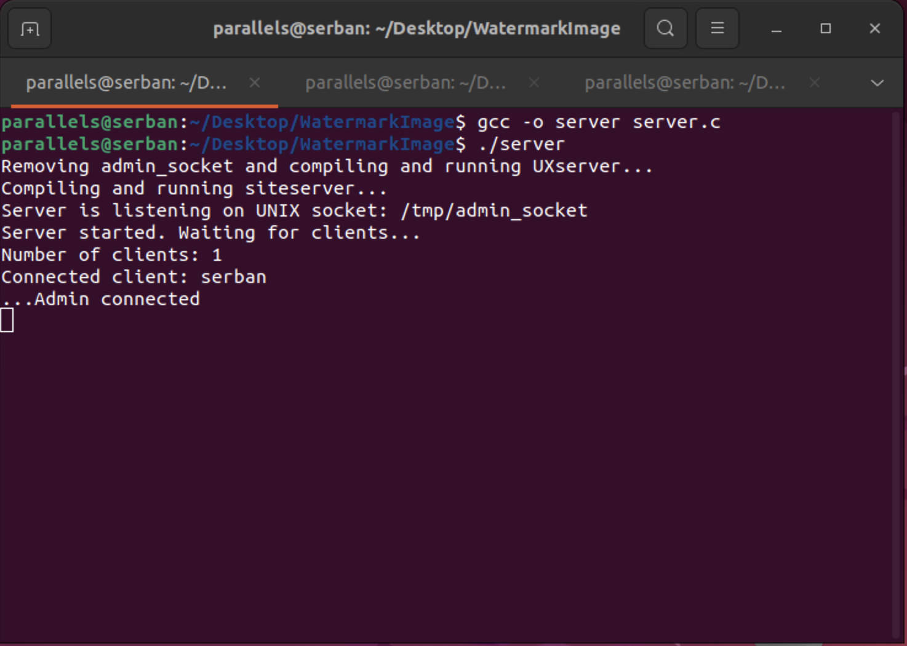
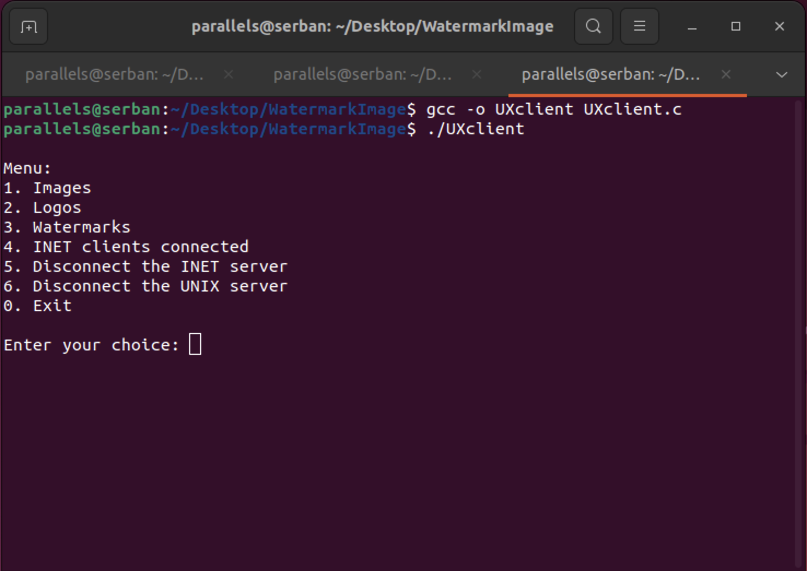
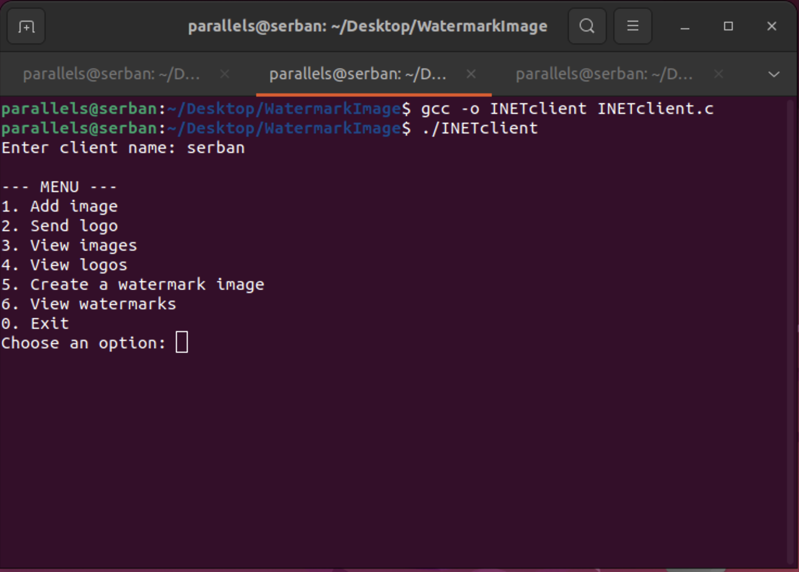

# WatermarkImage

# 1. Introduction 

The aim of this project is to develop a system that allows customers to add a watermark to their images. The system consists of an INET server implemented in C, an INET client implemented in C and Python, and a UNIX server and client, both implemented in C.

The system allows clients to submit their images and logos to the server, select an image and a logo for adding the watermark, and specify the desired location of the watermark on the image. The server uses ImageMagick to create the watermarked image according to client specifications.

Clients can view the watermarked images and receive the applied watermarked image from the server. Clients can also choose the location where to save the modified image by providing the desired path.

The system aims to provide a convenient and easy-to-use way to add the watermark to images, allowing customers to protect their visual content and retain their ownership rights.

# 2. Components
 
# INET Server
**The INET Server** is the main component of the watermark addition system and is responsible for receiving and processing requests from customers. It provides an interface through which clients can interact with the system and perform various operations. Here is a description of the INET server functionalities: 

**Receiving client name:**
The server receives the client name from the client before displaying the menu. 
Using the sock.recv() function, the server receives the client name as a string. The client name is decoded and used to identify the client within the system.

**Menu:**
After receiving the client name, the server receives commands from the main menu for interacting with the client.
The menu contains the following options:
1. Add image
2. Send logo
3. View images
4. View logos
5. Create image with watermark
6. View watermarks
0. Output

The server waits for the client to select an option and sends the selected option to the client for processing.

**Features:**
The server receives the option selected by the client and performs the corresponding operation according to it.
For each option, the server interacts with the client to obtain the required information and performs the actions specific to the request.

**Communication with the client:**
The server uses the socket to receive and send data to the client.
The data sent and received is in binary format and is properly encoded and decoded to ensure correct communication between the server and the client.
The INET server is the central component of the system and handles all incoming requests from clients, ensuring that operations are performed properly and that results are sent back to the client for viewing or use.

# INET client
**The INET client** is the interface through which users can interact with the server and perform various operations within the watermark addition system, it exists in two programming language variants: C and Python. Here is a description of the functionalities of the 
INET client:

**Enter client name:**
When the client starts, it prompts the user to enter their name.
Using the input() function, the client waits for the user to enter their name and then sends the name to the server for identification.

**Menu:**
After entering the client's name, the client displays a menu containing the options available within the add watermark system.
The menu contains the following options: 1. Add image
2. Send logo
3. View images
4. View logos
5. Create image with watermark
6. View watermarks
0. Output
The client waits for the user to select an option and sends the selected option to the server for processing.

**Interaction with the server:**
The client uses a socket to establish a connection with the server and to send and receive data.
For each option selected by the user, the client sends the corresponding request to the server and waits for the server's response.

**Sending data to the server:**
Depending on the option selected, the client prompts the user to enter the required information, such as the image or logo path.
The client reads the data entered by the user and sends it to the server using the socket, ensuring that the data is sent in binary format and properly encoded.

**Receiving data from the server:**
After sending the request to the server, the client waits for the server's response and receives the data corresponding to its request.
The client receives and displays the relevant information returned by the server, such as the names of available images or logos or the watermark image created.
The INET client allows users to easily interact with the server and perform system-specific operations to add the watermark. Through the menu and interaction with the server, users can manage images, logos and watermarks as well as view and receive the desired results.

# UNIX server
**The UNIX server** is the core component of the watermark system, which manages the administrative operations and allows the management of images, logos and watermarks. Here is a description of the UNIX server functionality:

**Menu:**
The UNIX server accepts commands from a menu to allow the administrator to perform administrative operations on images, logos and watermark, as well as manage the connection to the INET server.
The menu contains the following options: a. Images b. Logos c. Watermarks d. Connected INET clients e. Disconnect INET server f. Exit
The server waits for the administrator to select an option and send the appropriate command to perform the desired operation.

**Image management:**
The "Images" option allows the administrator to view, delete and rename existing images in the system.
The administrator can select the "Images" option and then choose from the available options for image management.

**Logo management:**
The "Logos" option allows the administrator to view, delete and rename existing logos in the system.
The administrator can select the "Logos" option and then choose from the available options for logo management.

**Watermark management:**
The "Watermarks" option allows the administrator to view, delete and rename existing watermarks in the system. The administrator can select the "Watermarks" option and then choose from the available options for watermark management.

**Connected INET clients:**
The "Connected INET clients" option allows the administrator to view the list of INET clients connected to the server.

**Disconnet INET server:**
The "Disconnect INET server" option allows the administrator to close the INET server connection, thus stopping communication with INET clients.

**Logout:**
The "Logout" option allows the administrator to end the session and close the UNIX server. The UNIX server gives the administrator control over the images, logos, watermark and INET server connection. Through the menu and available options, the administrator can perform administrative operations essential for managing the watermark system.

# UNIX client
**The UNIX client** is the component that allows the administrator to interact with the UNIX server to manage images, logos and watermarks. Here is a description of the UNIX client functionality:

**Menu:**
The UNIX client displays an interactive menu to allow the administrator to select options and perform operations on images, logos, and watermarks.
The UNIX client menu includes the following options: a. Images b. Logos c. Watermarks d. Connected INET clients e. Disconnect INET server f. Exit
The administrator can select one of the options by entering a number corresponding to the desired option.

**Image management:**
The "Images" option allows the administrator to view, delete and rename existing images in the system.
The administrator can select the "Images" option and then choose from the available options for image management.

**Logo management:**
The "Logos" option allows the administrator to view, delete and rename existing logos in the system.
The administrator can select the "Logos" option and then choose from the available options for logo management.

**Watermark management:**
The "Watermarks" option allows the administrator to view, delete and rename existing watermarks in the system.
The administrator can select the "Watermarks" option and then choose from the available options for watermark management.

**Connected INET clients:**
The "Connected INET clients" option allows the administrator to get the list of INET clients connected to the INET server.

**Disconnect INET server:**
The "Disconnect INET server" option allows the administrator to send a disconnect request to the INET server, thus stopping communication with the INET server.

**Disconnect UNIX server:**
The "Disconnect UNIX server" option allows the administrator to send a disconnect request to the UNIX server, thus stopping communication with the UNIX server.

**Logout:**
The "Logout" option allows the administrator to end the session and log out of the UNIX client. The UNIX client provides the administrator with a simple and efficient interface for managing images, logos, watermarks and communication with the UNIX server. Through the menu and available options, the administrator can perform system administration operations of adding the watermark in a convenient and efficient way.

# 3. Running program
 
# server

# INET client

# UNIX client

# 4. Image restoration
**Logo resize:** The MagickScaleImage function is used to resize the logo image (logo_wand) to a desired size relative to the original image (image_wand). The logo size is adjusted using the width and height of the original image multiplied by a factor of 0.2. This resizes the logo to 20% of the original image size.

**Transparency adjustment:** The MagickEvaluateImageChannel function is used to change the transparency (opacity) of the logo. The alpha channel of the logo image is evaluated using the AlphaChannel option and the MultiplyEvaluateOperator. This operation decreases the opacity of the logo by a factor of 0.5, effectively increasing its transparency.

**Determining the watermark position:** The position of the watermark on the image is determined according to the watermarkPosition argument provided. The switch statement evaluates the position of the watermark and sets the posX and posY variables accordingly. These coordinates determine the location of the logo on the image.

**Image compositing:** The MagickCompositeImage function is used to composite the logo over the original image. The logo (logo_wand) is composited over the image (image_wand) using the OverCompositeOp operator. The variables posX and posY specify the position where the logo will be placed on the image.

**Saving the watermarked image:** The MagickWriteImage function is used to save the watermarked image to the location specified by outputPath. If the image cannot be saved, an error message is displayed.

**Success message display:** If the image is successfully saved and contains the watermark, a success message is displayed indicating the path to the watermarked image.

# 5. Conclusion
The process of adding a watermark to an image is an important one in image processing. Using the MagickWand API, we have presented a sequence of steps to perform this operation.

First, the logo is resized to match the dimensions of the underlying image. Next, the transparency of the logo is adjusted to achieve a desired opacity effect. The next step is to determine the position of the watermark on the image, taking into account available options such as the corners, centre and edges of the image. The logo is then composited over the image using the overlay operation. Finally, the resulting image containing the watermark is saved to a specified location.

Adding a watermark to an image can be useful in protecting copyright, identifying origin or promoting a brand. This process can be integrated into a wider application involving image manipulation and gives users the ability to customise and manage watermarks more effectively.

In summary, the process of adding a watermark to an image involves multiple steps, including resizing the logo, adjusting the transparency, determining the position of the watermark, compositing the logo with the image and saving the final result.
